How every endpoint in hint's Kotlin API is used: what the user does in the Vue app, which hint endpoint it hits, what hint then does with Postgres, the file shares and hintr (R), and where Redis comes in.

Written against `main` on 2026-10-19. Frontend callers were found by searching `src/app/static/src/app`.

## Contents

1. [Behaviour on every request](#1-behaviour-on-every-request)
2. [Opening the app, logging in and out](#2-opening-the-app-logging-in-and-out)
3. [Forgotten password](#3-forgotten-password)
4. [Projects](#4-projects)
5. [Versions, autosave and opening a saved version](#5-versions-autosave-and-opening-a-saved-version)
6. [Upload baseline files (PJNZ, shape, population)](#6-upload-baseline-files-pjnz-shape-population)
7. [Upload survey, programme, ANC and VMMC](#7-upload-survey-programme-anc-and-vmmc)
8. [Refreshing the page](#8-refreshing-the-page)
9. [Import inputs from ADR](#9-import-inputs-from-adr)
10. [Load a project from an output zip or ADR (rehydrate)](#10-load-a-project-from-an-output-zip-or-adr-rehydrate)
11. [Review inputs](#11-review-inputs)
12. [Model options](#12-model-options)
13. [Run a model fit](#13-run-a-model-fit)
14. [Calibrate](#14-calibrate)
15. [View calibrated results](#15-view-calibrated-results)
16. [Download outputs](#16-download-outputs)
17. [Push outputs and inputs to ADR](#17-push-outputs-and-inputs-to-adr)
18. [Debug bundle](#18-debug-bundle)
19. [Error report](#19-error-report)
20. [Version menu, monitoring and proxy routes](#20-version-menu-monitoring-and-proxy-routes)
21. [Endpoint index](#endpoint-index): every endpoint, which diagram covers it, and where Redis is involved

## How to read the diagrams

| Lane | What it is |
| --- | --- |
| **User (Vue app)** | The browser. Arrows from here are what the user triggered. |
| **hint** | The Kotlin/Spring app on Azure App Service. Mounts `/uploads`, `/results` and `/etc/hint` from Azure Files. |
| **Postgres** (blue lane) | hint's own database. Tables: `project`, `project_version` (holds the saved `state` JSON), `version_file`, `file`, `users`, `ADR_key`, `onetime_token`. |
| **hintr API** | The R API (porcelain). hint is its only caller, via `HintrFuelAPIClient`. |
| **Redis** (red lane) | rrq's store: queue, task status and progress, **task results**, task inputs. This is the part you want to remove. |
| **hintr worker** | An R worker (Container App Job, started by KEDA) running naomi. |
| **File shares** | Azure Files `uploads` (user inputs, named by content hash) and `results` (model outputs). |

Arrow labels are `METHOD /path`. Where hint calls hintr, the label is the hintr route, not the hint route. Where hint or hintr talk to Redis, the label names the rrq call.

## 1. Behaviour on every request

Applies to all the diagrams below. Shown once so the others can stay readable.

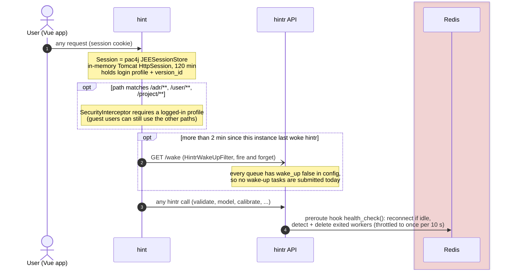
```mermaid
sequenceDiagram
    autonumber
    actor U as User (Vue app)
    participant H as hint
    participant R as hintr API
    box rgba(230,70,70,0.18)
    participant RD as Redis
    end

    U->>H: any request (session cookie)
    Note over H: Session = pac4j JEESessionStore<br/>in-memory Tomcat HttpSession, 120 min<br/>holds login profile + version_id
    opt path matches /adr/**, /user/**, /project/**
        Note over H: SecurityInterceptor requires a logged-in profile<br/>(guest users can still use the other paths)
    end
    opt more than 2 min since this instance last woke hintr
        H-)R: GET /wake (HintrWakeUpFilter, fire and forget)
        Note over R: every queue has wake_up false in config,<br/>so no wake-up tasks are submitted today
    end
    H->>R: any hintr call (validate, model, calibrate, ...)
    R->>RD: preroute hook health_check(): reconnect if idle,<br/>detect + delete exited workers (throttled to once per 10 s)
```

## 2. Opening the app, logging in and out

Users can work as a guest (no login, state kept in the session and browser). Logged-in users get projects saved in Postgres.

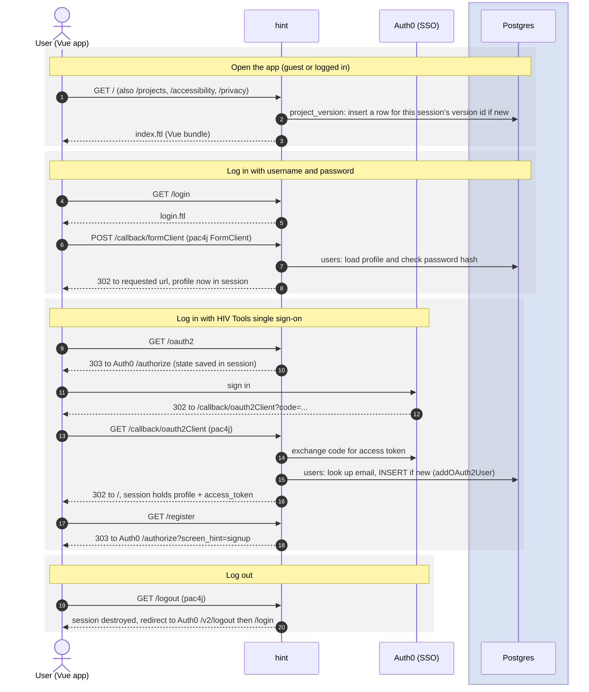
```mermaid
sequenceDiagram
    autonumber
    actor U as User (Vue app)
    participant H as hint
    participant A0 as Auth0 (SSO)
    box rgba(70,130,230,0.15)
    participant PG as Postgres
    end

    rect rgba(150,150,150,0.12)
    Note over U,PG: Open the app (guest or logged in)
    U->>H: GET / (also /projects, /accessibility, /privacy)
    H->>PG: project_version: insert a row for this session's version id if new
    H-->>U: index.ftl (Vue bundle)
    end

    rect rgba(150,150,150,0.12)
    Note over U,PG: Log in with username and password
    U->>H: GET /login
    H-->>U: login.ftl
    U->>H: POST /callback/formClient (pac4j FormClient)
    H->>PG: users: load profile and check password hash
    H-->>U: 302 to requested url, profile now in session
    end

    rect rgba(150,150,150,0.12)
    Note over U,A0: Log in with HIV Tools single sign-on
    U->>H: GET /oauth2
    H-->>U: 303 to Auth0 /authorize (state saved in session)
    U->>A0: sign in
    A0-->>U: 302 to /callback/oauth2Client?code=...
    U->>H: GET /callback/oauth2Client (pac4j)
    H->>A0: exchange code for access token
    H->>PG: users: look up email, INSERT if new (addOAuth2User)
    H-->>U: 302 to /, session holds profile + access_token
    U->>H: GET /register
    H-->>U: 303 to Auth0 /authorize?screen_hint=signup
    end

    rect rgba(150,150,150,0.12)
    Note over U,A0: Log out
    U->>H: GET /logout (pac4j)
    H-->>U: session destroyed, redirect to Auth0 /v2/logout then /login
    end
```

`/callback/*` and `/logout` are provided by pac4j, not by a Kotlin controller. There is no R and no Redis involvement.

## 3. Forgotten password

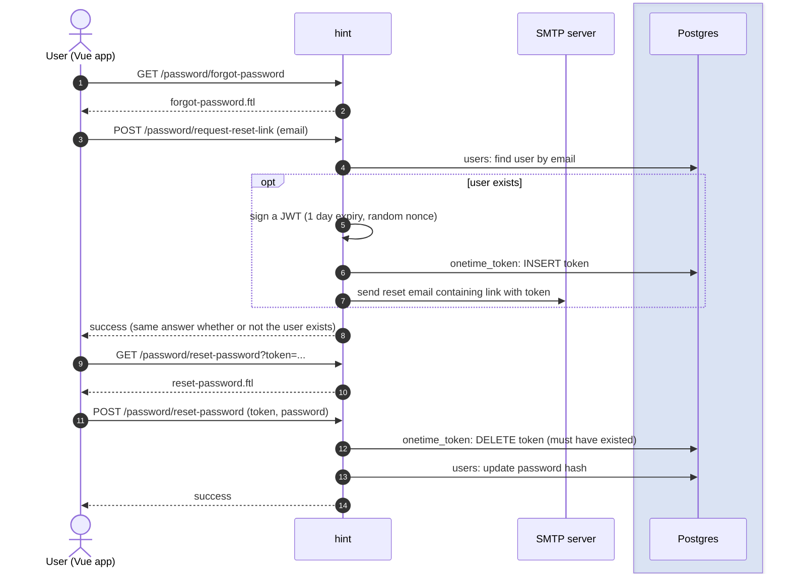
```mermaid
sequenceDiagram
    autonumber
    actor U as User (Vue app)
    participant H as hint
    participant M as SMTP server
    box rgba(70,130,230,0.15)
    participant PG as Postgres
    end

    U->>H: GET /password/forgot-password
    H-->>U: forgot-password.ftl
    U->>H: POST /password/request-reset-link (email)
    H->>PG: users: find user by email
    opt user exists
        H->>H: sign a JWT (1 day expiry, random nonce)
        H->>PG: onetime_token: INSERT token
        H->>M: send reset email containing link with token
    end
    H-->>U: success (same answer whether or not the user exists)
    U->>H: GET /password/reset-password?token=...
    H-->>U: reset-password.ftl
    U->>H: POST /password/reset-password (token, password)
    H->>PG: onetime_token: DELETE token (must have existed)
    H->>PG: users: update password hash
    H-->>U: success
```

## 4. Projects

Logged-in users only. Everything here is Postgres only: no R, no Redis, no file shares.

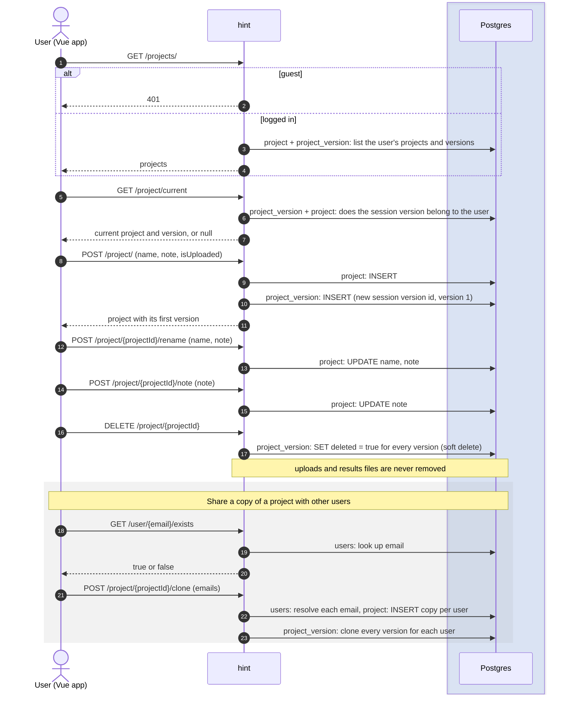
```mermaid
sequenceDiagram
    autonumber
    actor U as User (Vue app)
    participant H as hint
    box rgba(70,130,230,0.15)
    participant PG as Postgres
    end

    U->>H: GET /projects/
    alt guest
        H-->>U: 401
    else logged in
        H->>PG: project + project_version: list the user's projects and versions
        H-->>U: projects
    end
    U->>H: GET /project/current
    H->>PG: project_version + project: does the session version belong to the user
    H-->>U: current project and version, or null
    U->>H: POST /project/ (name, note, isUploaded)
    H->>PG: project: INSERT
    H->>PG: project_version: INSERT (new session version id, version 1)
    H-->>U: project with its first version
    U->>H: POST /project/{projectId}/rename (name, note)
    H->>PG: project: UPDATE name, note
    U->>H: POST /project/{projectId}/note (note)
    H->>PG: project: UPDATE note
    U->>H: DELETE /project/{projectId}
    H->>PG: project_version: SET deleted = true for every version (soft delete)
    Note over H,PG: uploads and results files are never removed

    rect rgba(150,150,150,0.12)
    Note over U,PG: Share a copy of a project with other users
    U->>H: GET /user/{email}/exists
    H->>PG: users: look up email
    H-->>U: true or false
    U->>H: POST /project/{projectId}/clone (emails)
    H->>PG: users: resolve each email, project: INSERT copy per user
    H->>PG: project_version: clone every version for each user
    end
```

## 5. Versions, autosave and opening a saved version

The saved `state` is the whole Vuex state as JSON. It includes the model fit and calibrate task IDs, which is the link from Postgres to Redis results.

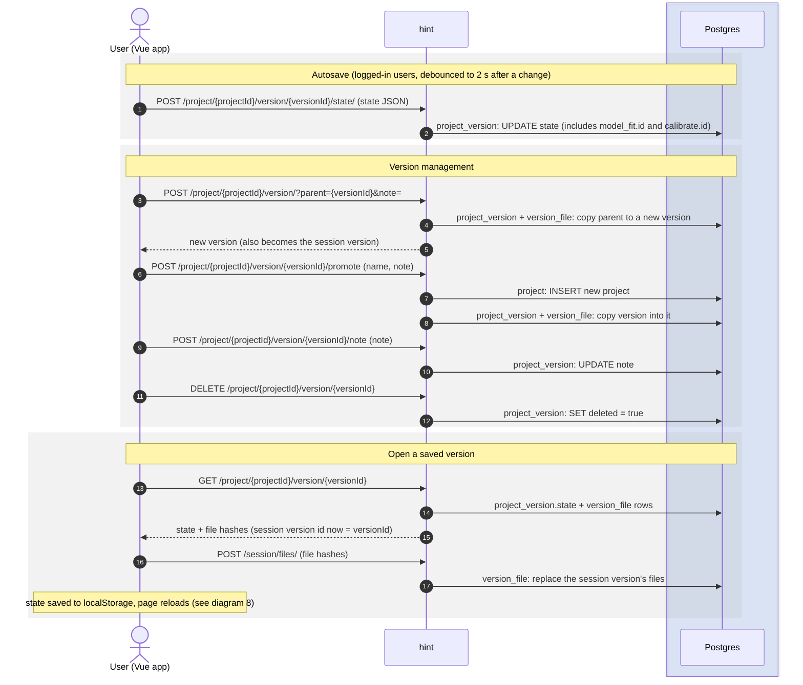
```mermaid
sequenceDiagram
    autonumber
    actor U as User (Vue app)
    participant H as hint
    box rgba(70,130,230,0.15)
    participant PG as Postgres
    end

    rect rgba(150,150,150,0.12)
    Note over U,PG: Autosave (logged-in users, debounced to 2 s after a change)
    U->>H: POST /project/{projectId}/version/{versionId}/state/ (state JSON)
    H->>PG: project_version: UPDATE state (includes model_fit.id and calibrate.id)
    end

    rect rgba(150,150,150,0.12)
    Note over U,PG: Version management
    U->>H: POST /project/{projectId}/version/?parent={versionId}&note=
    H->>PG: project_version + version_file: copy parent to a new version
    H-->>U: new version (also becomes the session version)
    U->>H: POST /project/{projectId}/version/{versionId}/promote (name, note)
    H->>PG: project: INSERT new project
    H->>PG: project_version + version_file: copy version into it
    U->>H: POST /project/{projectId}/version/{versionId}/note (note)
    H->>PG: project_version: UPDATE note
    U->>H: DELETE /project/{projectId}/version/{versionId}
    H->>PG: project_version: SET deleted = true
    end

    rect rgba(150,150,150,0.12)
    Note over U,PG: Open a saved version
    U->>H: GET /project/{projectId}/version/{versionId}
    H->>PG: project_version.state + version_file rows
    H-->>U: state + file hashes (session version id now = versionId)
    U->>H: POST /session/files/ (file hashes)
    H->>PG: version_file: replace the session version's files
    Note over U: state saved to localStorage, page reloads (see diagram 8)
    end
```

## 6. Upload baseline files (PJNZ, shape, population)

Same flow for all three types: `/baseline/pjnz/`, `/baseline/shape/`, `/baseline/population/`.

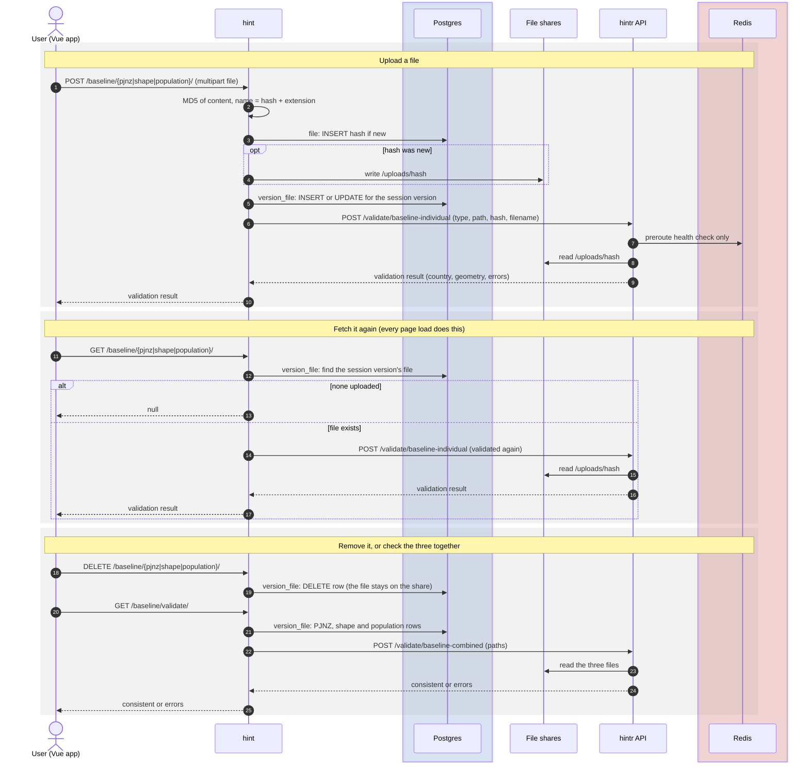
```mermaid
sequenceDiagram
    autonumber
    actor U as User (Vue app)
    participant H as hint
    box rgba(70,130,230,0.15)
    participant PG as Postgres
    end
    participant FS as File shares
    participant R as hintr API
    box rgba(230,70,70,0.18)
    participant RD as Redis
    end

    rect rgba(150,150,150,0.12)
    Note over U,RD: Upload a file
    U->>H: POST /baseline/{pjnz|shape|population}/ (multipart file)
    H->>H: MD5 of content, name = hash + extension
    H->>PG: file: INSERT hash if new
    opt hash was new
        H->>FS: write /uploads/hash
    end
    H->>PG: version_file: INSERT or UPDATE for the session version
    H->>R: POST /validate/baseline-individual (type, path, hash, filename)
    R->>RD: preroute health check only
    R->>FS: read /uploads/hash
    R-->>H: validation result (country, geometry, errors)
    H-->>U: validation result
    end

    rect rgba(150,150,150,0.12)
    Note over U,RD: Fetch it again (every page load does this)
    U->>H: GET /baseline/{pjnz|shape|population}/
    H->>PG: version_file: find the session version's file
    alt none uploaded
        H-->>U: null
    else file exists
        H->>R: POST /validate/baseline-individual (validated again)
        R->>FS: read /uploads/hash
        R-->>H: validation result
        H-->>U: validation result
    end
    end

    rect rgba(150,150,150,0.12)
    Note over U,RD: Remove it, or check the three together
    U->>H: DELETE /baseline/{pjnz|shape|population}/
    H->>PG: version_file: DELETE row (the file stays on the share)
    U->>H: GET /baseline/validate/
    H->>PG: version_file: PJNZ, shape and population rows
    H->>R: POST /validate/baseline-combined (paths)
    R->>FS: read the three files
    R-->>H: consistent or errors
    H-->>U: consistent or errors
    end
```

## 7. Upload survey, programme, ANC and VMMC

Same flow for `/disease/survey/`, `/disease/programme/`, `/disease/anc/` and `/disease/vmmc/`. These need the shape file (and, in strict mode, the PJNZ) to already exist.

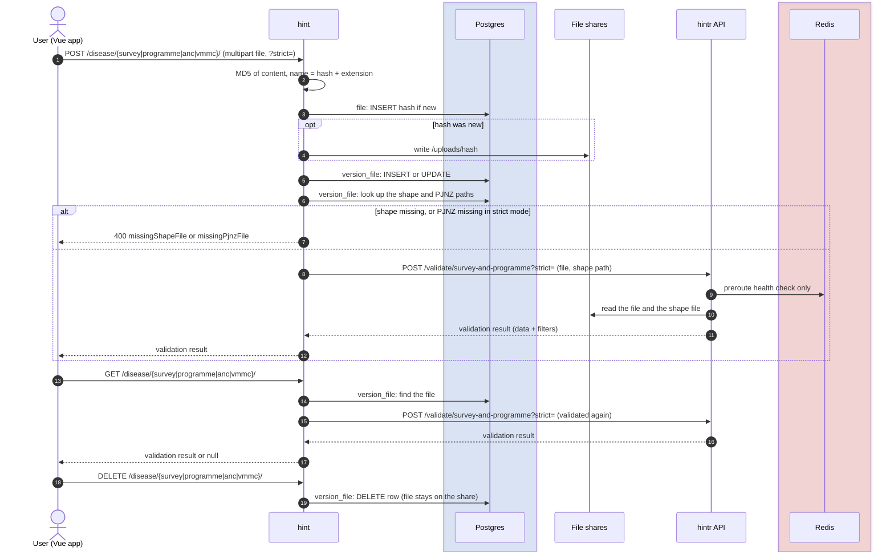
```mermaid
sequenceDiagram
    autonumber
    actor U as User (Vue app)
    participant H as hint
    box rgba(70,130,230,0.15)
    participant PG as Postgres
    end
    participant FS as File shares
    participant R as hintr API
    box rgba(230,70,70,0.18)
    participant RD as Redis
    end

    U->>H: POST /disease/{survey|programme|anc|vmmc}/ (multipart file, ?strict=)
    H->>H: MD5 of content, name = hash + extension
    H->>PG: file: INSERT hash if new
    opt hash was new
        H->>FS: write /uploads/hash
    end
    H->>PG: version_file: INSERT or UPDATE
    H->>PG: version_file: look up the shape and PJNZ paths
    alt shape missing, or PJNZ missing in strict mode
        H-->>U: 400 missingShapeFile or missingPjnzFile
    else
        H->>R: POST /validate/survey-and-programme?strict= (file, shape path)
        R->>RD: preroute health check only
        R->>FS: read the file and the shape file
        R-->>H: validation result (data + filters)
        H-->>U: validation result
    end

    U->>H: GET /disease/{survey|programme|anc|vmmc}/
    H->>PG: version_file: find the file
    H->>R: POST /validate/survey-and-programme?strict= (validated again)
    R-->>H: validation result
    H-->>U: validation result or null

    U->>H: DELETE /disease/{survey|programme|anc|vmmc}/
    H->>PG: version_file: DELETE row (file stays on the share)
```

## 8. Refreshing the page

Reloading, or opening a saved project (which reloads), re-validates every uploaded file through R, then re-fetches results if the saved state says the fit and calibration are done. `Hint.vue` does the baseline load before mount, then the rest once the baseline is ready.

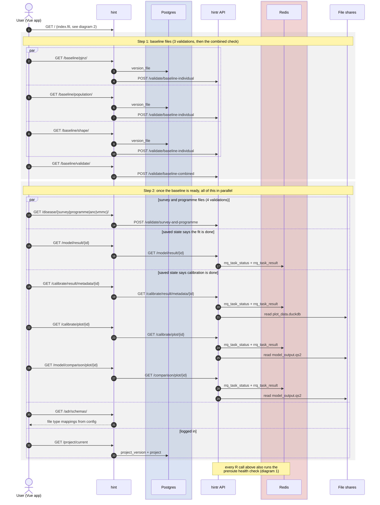
```mermaid
sequenceDiagram
    autonumber
    actor U as User (Vue app)
    participant H as hint
    box rgba(70,130,230,0.15)
    participant PG as Postgres
    end
    participant R as hintr API
    box rgba(230,70,70,0.18)
    participant RD as Redis
    end
    participant FS as File shares

    U->>H: GET / (index.ftl, see diagram 2)

    rect rgba(150,150,150,0.12)
    Note over U,FS: Step 1: baseline files (3 validations, then the combined check)
    par
        U->>H: GET /baseline/pjnz/
        H->>PG: version_file
        H->>R: POST /validate/baseline-individual
    and
        U->>H: GET /baseline/population/
        H->>PG: version_file
        H->>R: POST /validate/baseline-individual
    and
        U->>H: GET /baseline/shape/
        H->>PG: version_file
        H->>R: POST /validate/baseline-individual
    end
    U->>H: GET /baseline/validate/
    H->>R: POST /validate/baseline-combined
    end

    rect rgba(150,150,150,0.12)
    Note over U,FS: Step 2: once the baseline is ready, all of this in parallel
    par survey and programme files (4 validations)
        U->>H: GET /disease/{survey|programme|anc|vmmc}/
        H->>R: POST /validate/survey-and-programme
    and saved state says the fit is done
        U->>H: GET /model/result/{id}
        H->>R: GET /model/result/{id}
        R->>RD: rrq_task_status + rrq_task_result
    and saved state says calibration is done
        U->>H: GET /calibrate/result/metadata/{id}
        H->>R: GET /calibrate/result/metadata/{id}
        R->>RD: rrq_task_status + rrq_task_result
        R->>FS: read plot_data.duckdb
        U->>H: GET /calibrate/plot/{id}
        H->>R: GET /calibrate/plot/{id}
        R->>RD: rrq_task_status + rrq_task_result
        R->>FS: read model_output.qs2
        U->>H: GET /model/comparison/plot/{id}
        H->>R: GET /comparison/plot/{id}
        R->>RD: rrq_task_status + rrq_task_result
        R->>FS: read model_output.qs2
    and
        U->>H: GET /adr/schemas/
        H-->>U: file type mappings from config
    and logged in
        U->>H: GET /project/current
        H->>PG: project_version + project
    end
    end
    Note over R,RD: every R call above also runs the<br/>preroute health check (diagram 1)
```

Up to 8 validation calls plus 4 Redis-backed calls on every reload of a calibrated project. In diagram 15, `filteredData` bypasses R for the map data, but these three still use it.

## 9. Import inputs from ADR

ADR is the UNAIDS data repository. hint builds an ADR client per request: an API key from Postgres (decrypted) or, with SSO login, the user's Auth0 access token from the session.

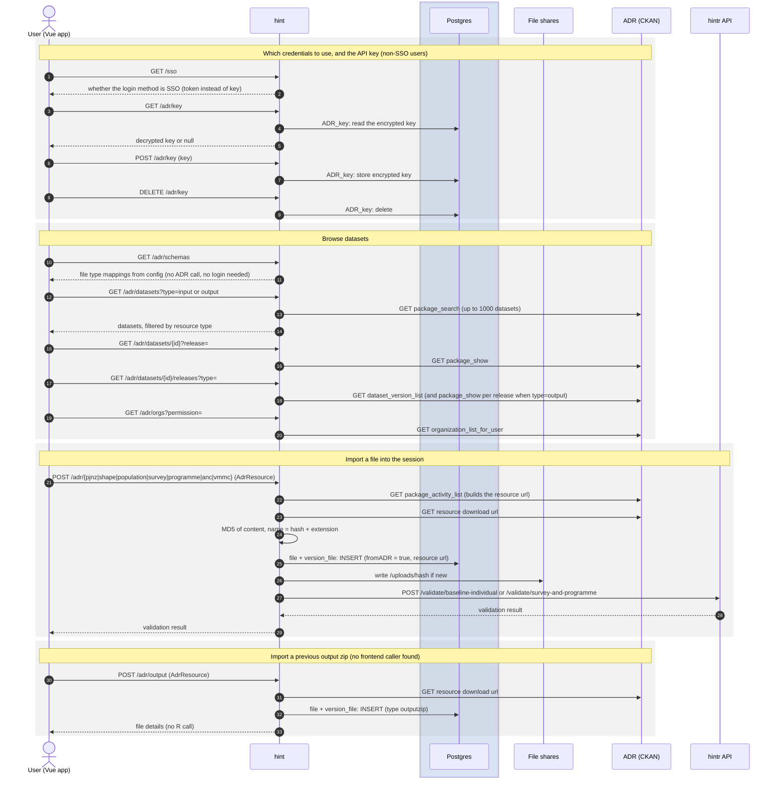
```mermaid
sequenceDiagram
    autonumber
    actor U as User (Vue app)
    participant H as hint
    box rgba(70,130,230,0.15)
    participant PG as Postgres
    end
    participant FS as File shares
    participant ADR as ADR (CKAN)
    participant R as hintr API

    rect rgba(150,150,150,0.12)
    Note over U,ADR: Which credentials to use, and the API key (non-SSO users)
    U->>H: GET /sso
    H-->>U: whether the login method is SSO (token instead of key)
    U->>H: GET /adr/key
    H->>PG: ADR_key: read the encrypted key
    H-->>U: decrypted key or null
    U->>H: POST /adr/key (key)
    H->>PG: ADR_key: store encrypted key
    U->>H: DELETE /adr/key
    H->>PG: ADR_key: delete
    end

    rect rgba(150,150,150,0.12)
    Note over U,ADR: Browse datasets
    U->>H: GET /adr/schemas
    H-->>U: file type mappings from config (no ADR call, no login needed)
    U->>H: GET /adr/datasets?type=input or output
    H->>ADR: GET package_search (up to 1000 datasets)
    H-->>U: datasets, filtered by resource type
    U->>H: GET /adr/datasets/{id}?release=
    H->>ADR: GET package_show
    U->>H: GET /adr/datasets/{id}/releases?type=
    H->>ADR: GET dataset_version_list (and package_show per release when type=output)
    U->>H: GET /adr/orgs?permission=
    H->>ADR: GET organization_list_for_user
    end

    rect rgba(150,150,150,0.12)
    Note over U,R: Import a file into the session
    U->>H: POST /adr/{pjnz|shape|population|survey|programme|anc|vmmc} (AdrResource)
    H->>ADR: GET package_activity_list (builds the resource url)
    H->>ADR: GET resource download url
    H->>H: MD5 of content, name = hash + extension
    H->>PG: file + version_file: INSERT (fromADR = true, resource url)
    H->>FS: write /uploads/hash if new
    H->>R: POST /validate/baseline-individual or /validate/survey-and-programme
    R-->>H: validation result
    H-->>U: validation result
    end

    rect rgba(150,150,150,0.12)
    Note over U,ADR: Import a previous output zip (no frontend caller found)
    U->>H: POST /adr/output (AdrResource)
    H->>ADR: GET resource download url
    H->>PG: file + version_file: INSERT (type outputzip)
    H-->>U: file details (no R call)
    end
```

## 10. Load a project from an output zip or ADR (rehydrate)

The only flow where hint asks R and Redis whether old results still exist.

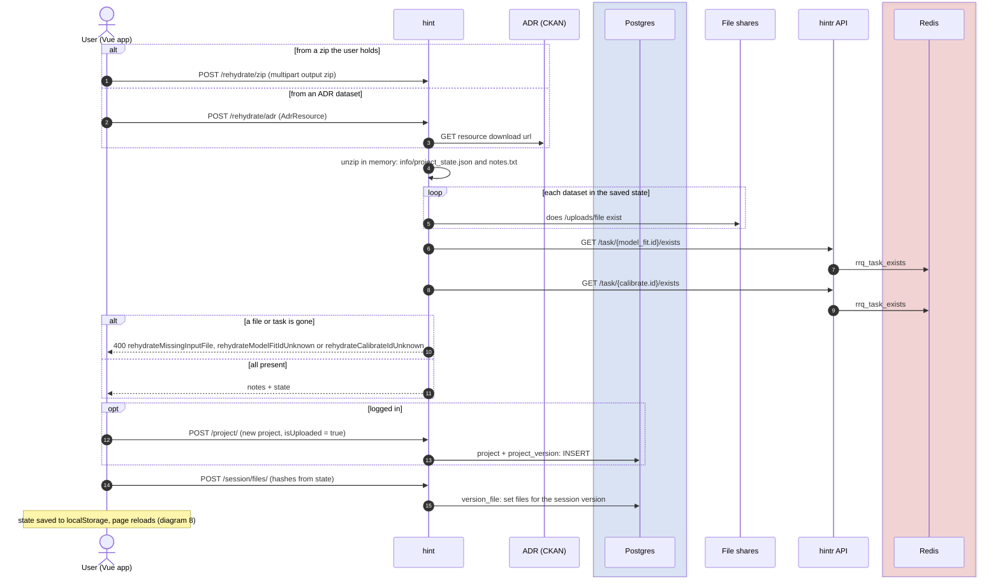
```mermaid
sequenceDiagram
    autonumber
    actor U as User (Vue app)
    participant H as hint
    participant ADR as ADR (CKAN)
    box rgba(70,130,230,0.15)
    participant PG as Postgres
    end
    participant FS as File shares
    participant R as hintr API
    box rgba(230,70,70,0.18)
    participant RD as Redis
    end

    alt from a zip the user holds
        U->>H: POST /rehydrate/zip (multipart output zip)
    else from an ADR dataset
        U->>H: POST /rehydrate/adr (AdrResource)
        H->>ADR: GET resource download url
    end
    H->>H: unzip in memory: info/project_state.json and notes.txt
    loop each dataset in the saved state
        H->>FS: does /uploads/file exist
    end
    H->>R: GET /task/{model_fit.id}/exists
    R->>RD: rrq_task_exists
    H->>R: GET /task/{calibrate.id}/exists
    R->>RD: rrq_task_exists
    alt a file or task is gone
        H-->>U: 400 rehydrateMissingInputFile, rehydrateModelFitIdUnknown or rehydrateCalibrateIdUnknown
    else all present
        H-->>U: notes + state
    end

    opt logged in
        U->>H: POST /project/ (new project, isUploaded = true)
        H->>PG: project + project_version: INSERT
    end
    U->>H: POST /session/files/ (hashes from state)
    H->>PG: version_file: set files for the session version
    Note over U: state saved to localStorage, page reloads (diagram 8)
```

## 11. Review inputs

The input review step draws charts from the uploaded files. hint looks up the session's files and hands paths to R.

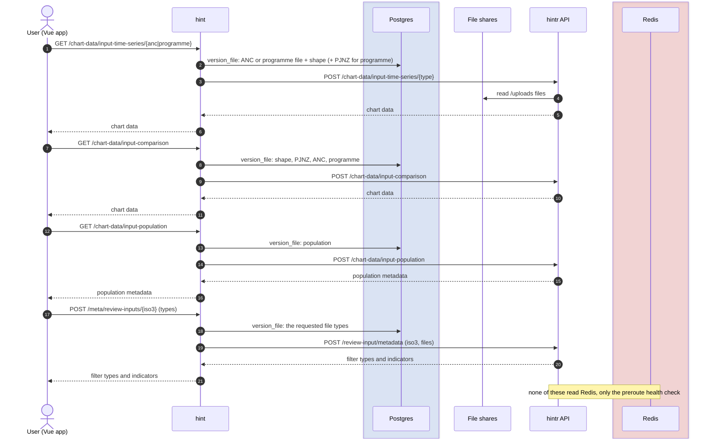
```mermaid
sequenceDiagram
    autonumber
    actor U as User (Vue app)
    participant H as hint
    box rgba(70,130,230,0.15)
    participant PG as Postgres
    end
    participant FS as File shares
    participant R as hintr API
    box rgba(230,70,70,0.18)
    participant RD as Redis
    end

    U->>H: GET /chart-data/input-time-series/{anc|programme}
    H->>PG: version_file: ANC or programme file + shape (+ PJNZ for programme)
    H->>R: POST /chart-data/input-time-series/{type}
    R->>FS: read /uploads files
    R-->>H: chart data
    H-->>U: chart data

    U->>H: GET /chart-data/input-comparison
    H->>PG: version_file: shape, PJNZ, ANC, programme
    H->>R: POST /chart-data/input-comparison
    R-->>H: chart data
    H-->>U: chart data

    U->>H: GET /chart-data/input-population
    H->>PG: version_file: population
    H->>R: POST /chart-data/input-population
    R-->>H: population metadata
    H-->>U: population metadata

    U->>H: POST /meta/review-inputs/{iso3} (types)
    H->>PG: version_file: the requested file types
    H->>R: POST /review-input/metadata (iso3, files)
    R-->>H: filter types and indicators
    H-->>U: filter types and indicators
    Note over R,RD: none of these read Redis, only the preroute health check
```

## 12. Model options

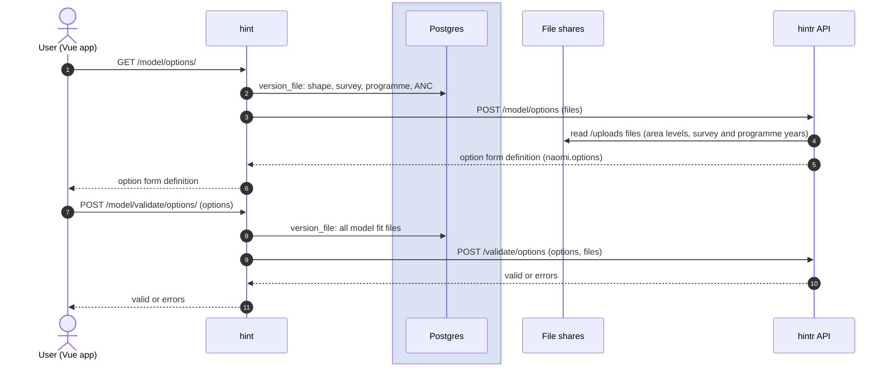
```mermaid
sequenceDiagram
    autonumber
    actor U as User (Vue app)
    participant H as hint
    box rgba(70,130,230,0.15)
    participant PG as Postgres
    end
    participant FS as File shares
    participant R as hintr API

    U->>H: GET /model/options/
    H->>PG: version_file: shape, survey, programme, ANC
    H->>R: POST /model/options (files)
    R->>FS: read /uploads files (area levels, survey and programme years)
    R-->>H: option form definition (naomi.options)
    H-->>U: option form definition

    U->>H: POST /model/validate/options/ (options)
    H->>PG: version_file: all model fit files
    H->>R: POST /validate/options (options, files)
    R-->>H: valid or errors
    H-->>U: valid or errors
```

## 13. Run a model fit

The slow path: submit, queue in Redis, a worker starts, the browser polls every 2 s. This is the main thing TaskAPI would replace.

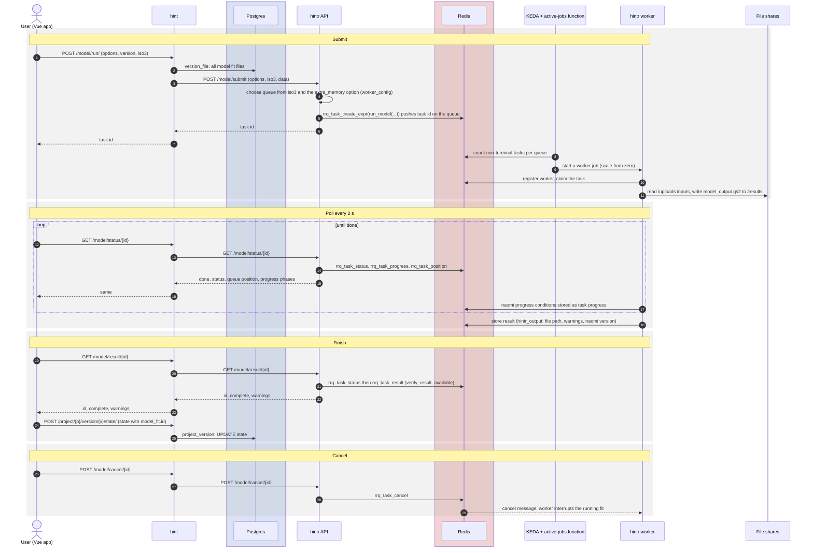
```mermaid
sequenceDiagram
    autonumber
    actor U as User (Vue app)
    participant H as hint
    box rgba(70,130,230,0.15)
    participant PG as Postgres
    end
    participant R as hintr API
    box rgba(230,70,70,0.18)
    participant RD as Redis
    end
    participant K as KEDA + active-jobs function
    participant W as hintr worker
    participant FS as File shares

    rect rgba(150,150,150,0.12)
    Note over U,W: Submit
    U->>H: POST /model/run/ (options, version, iso3)
    H->>PG: version_file: all model fit files
    H->>R: POST /model/submit (options, iso3, data)
    R->>R: choose queue from iso3 and the extra_memory option (worker_config)
    R->>RD: rrq_task_create_expr(run_model(...)) pushes task id on the queue
    R-->>H: task id
    H-->>U: task id
    K->>RD: count non-terminal tasks per queue
    K->>W: start a worker job (scale from zero)
    W->>RD: register worker, claim the task
    W->>FS: read /uploads inputs, write model_output.qs2 to /results
    end

    rect rgba(150,150,150,0.12)
    Note over U,W: Poll every 2 s
    loop until done
        U->>H: GET /model/status/{id}
        H->>R: GET /model/status/{id}
        R->>RD: rrq_task_status, rrq_task_progress, rrq_task_position
        R-->>H: done, status, queue position, progress phases
        H-->>U: same
        W->>RD: naomi progress conditions stored as task progress
    end
    W->>RD: store result (hintr_output: file path, warnings, naomi version)
    end

    rect rgba(150,150,150,0.12)
    Note over U,W: Finish
    U->>H: GET /model/result/{id}
    H->>R: GET /model/result/{id}
    R->>RD: rrq_task_status then rrq_task_result (verify_result_available)
    R-->>H: id, complete, warnings
    H-->>U: id, complete, warnings
    U->>H: POST /project/{p}/version/{v}/state/ (state with model_fit.id)
    H->>PG: project_version: UPDATE state
    end

    rect rgba(150,150,150,0.12)
    Note over U,W: Cancel
    U->>H: POST /model/cancel/{id}
    H->>R: POST /model/cancel/{id}
    R->>RD: rrq_task_cancel
    RD-->>W: cancel message, worker interrupts the running fit
    end
```

## 14. Calibrate

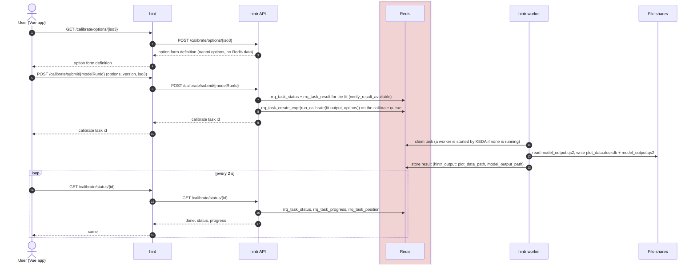
```mermaid
sequenceDiagram
    autonumber
    actor U as User (Vue app)
    participant H as hint
    participant R as hintr API
    box rgba(230,70,70,0.18)
    participant RD as Redis
    end
    participant W as hintr worker
    participant FS as File shares

    U->>H: GET /calibrate/options/{iso3}
    H->>R: POST /calibrate/options/{iso3}
    R-->>H: option form definition (naomi.options, no Redis data)
    H-->>U: option form definition

    U->>H: POST /calibrate/submit/{modelRunId} (options, version, iso3)
    H->>R: POST /calibrate/submit/{modelRunId}
    R->>RD: rrq_task_status + rrq_task_result for the fit (verify_result_available)
    R->>RD: rrq_task_create_expr(run_calibrate(fit output, options)) on the calibrate queue
    R-->>H: calibrate task id
    H-->>U: calibrate task id
    W->>RD: claim task (a worker is started by KEDA if none is running)
    W->>FS: read model_output.qs2, write plot_data.duckdb + model_output.qs2
    W->>RD: store result (hintr_output: plot_data_path, model_output_path)

    loop every 2 s
        U->>H: GET /calibrate/status/{id}
        H->>R: GET /calibrate/status/{id}
        R->>RD: rrq_task_status, rrq_task_progress, rrq_task_position
        R-->>H: done, status, progress
        H-->>U: same
    end
```

## 15. View calibrated results

Metadata, plots and map data after calibration. Three of these go through R; the data endpoints read the duckdb file directly.

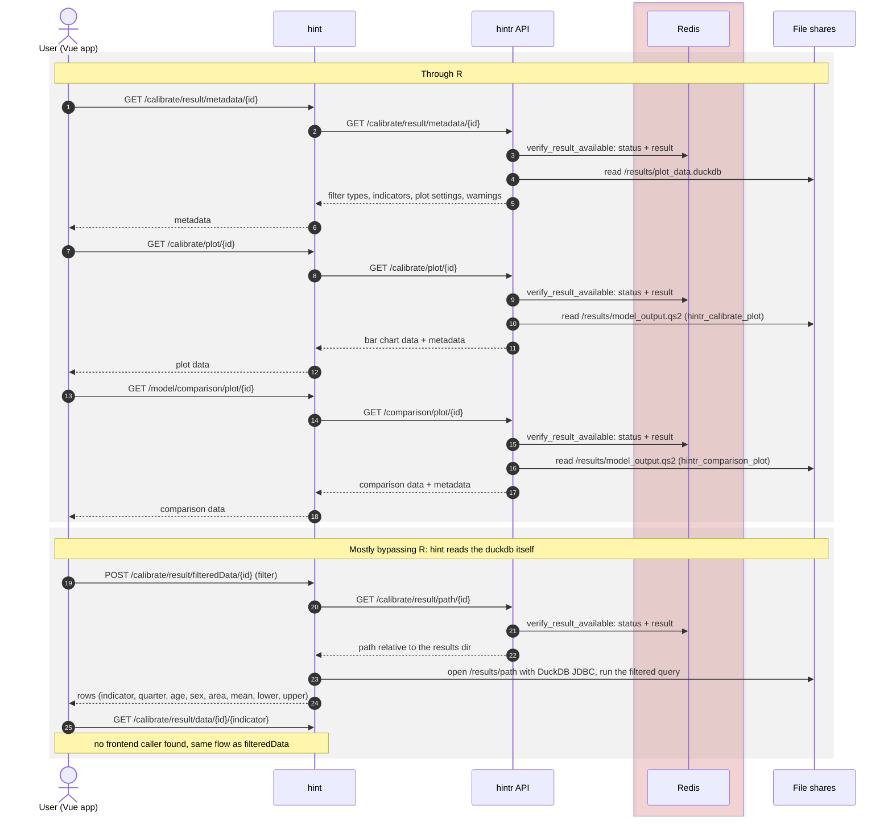
```mermaid
sequenceDiagram
    autonumber
    actor U as User (Vue app)
    participant H as hint
    participant R as hintr API
    box rgba(230,70,70,0.18)
    participant RD as Redis
    end
    participant FS as File shares

    rect rgba(150,150,150,0.12)
    Note over U,FS: Through R
    U->>H: GET /calibrate/result/metadata/{id}
    H->>R: GET /calibrate/result/metadata/{id}
    R->>RD: verify_result_available: status + result
    R->>FS: read /results/plot_data.duckdb
    R-->>H: filter types, indicators, plot settings, warnings
    H-->>U: metadata

    U->>H: GET /calibrate/plot/{id}
    H->>R: GET /calibrate/plot/{id}
    R->>RD: verify_result_available: status + result
    R->>FS: read /results/model_output.qs2 (hintr_calibrate_plot)
    R-->>H: bar chart data + metadata
    H-->>U: plot data

    U->>H: GET /model/comparison/plot/{id}
    H->>R: GET /comparison/plot/{id}
    R->>RD: verify_result_available: status + result
    R->>FS: read /results/model_output.qs2 (hintr_comparison_plot)
    R-->>H: comparison data + metadata
    H-->>U: comparison data
    end

    rect rgba(150,150,150,0.12)
    Note over U,FS: Mostly bypassing R: hint reads the duckdb itself
    U->>H: POST /calibrate/result/filteredData/{id} (filter)
    H->>R: GET /calibrate/result/path/{id}
    R->>RD: verify_result_available: status + result
    R-->>H: path relative to the results dir
    H->>FS: open /results/path with DuckDB JDBC, run the filtered query
    H-->>U: rows (indicator, quarter, age, sex, area, mean, lower, upper)

    U->>H: GET /calibrate/result/data/{id}/{indicator}
    Note over U,H: no frontend caller found, same flow as filteredData
    end
```

## 16. Download outputs

The UI submits one download per type in parallel (spectrum, coarse output, summary, comparison, AGYW, datapack), polls each, then offers the files.

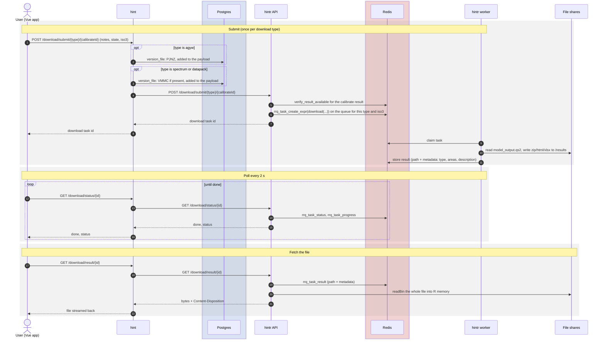
```mermaid
sequenceDiagram
    autonumber
    actor U as User (Vue app)
    participant H as hint
    box rgba(70,130,230,0.15)
    participant PG as Postgres
    end
    participant R as hintr API
    box rgba(230,70,70,0.18)
    participant RD as Redis
    end
    participant W as hintr worker
    participant FS as File shares

    rect rgba(150,150,150,0.12)
    Note over U,W: Submit (once per download type)
    U->>H: POST /download/submit/{type}/{calibrateId} (notes, state, iso3)
    opt type is agyw
        H->>PG: version_file: PJNZ, added to the payload
    end
    opt type is spectrum or datapack
        H->>PG: version_file: VMMC if present, added to the payload
    end
    H->>R: POST /download/submit/{type}/{calibrateId}
    R->>RD: verify_result_available for the calibrate result
    R->>RD: rrq_task_create_expr(download(...)) on the queue for this type and iso3
    R-->>H: download task id
    H-->>U: download task id
    W->>RD: claim task
    W->>FS: read model_output.qs2, write zip/html/xlsx to /results
    W->>RD: store result (path + metadata: type, areas, description)
    end

    rect rgba(150,150,150,0.12)
    Note over U,W: Poll every 2 s
    loop until done
        U->>H: GET /download/status/{id}
        H->>R: GET /download/status/{id}
        R->>RD: rrq_task_status, rrq_task_progress
        R-->>H: done, status
        H-->>U: done, status
    end
    end

    rect rgba(150,150,150,0.12)
    Note over U,FS: Fetch the file
    U->>H: GET /download/result/{id}
    H->>R: GET /download/result/{id}
    R->>RD: rrq_task_result (path + metadata)
    R->>FS: readBin the whole file into R memory
    R-->>H: bytes + Content-Disposition
    H-->>U: file streamed back
    end
```

## 17. Push outputs and inputs to ADR

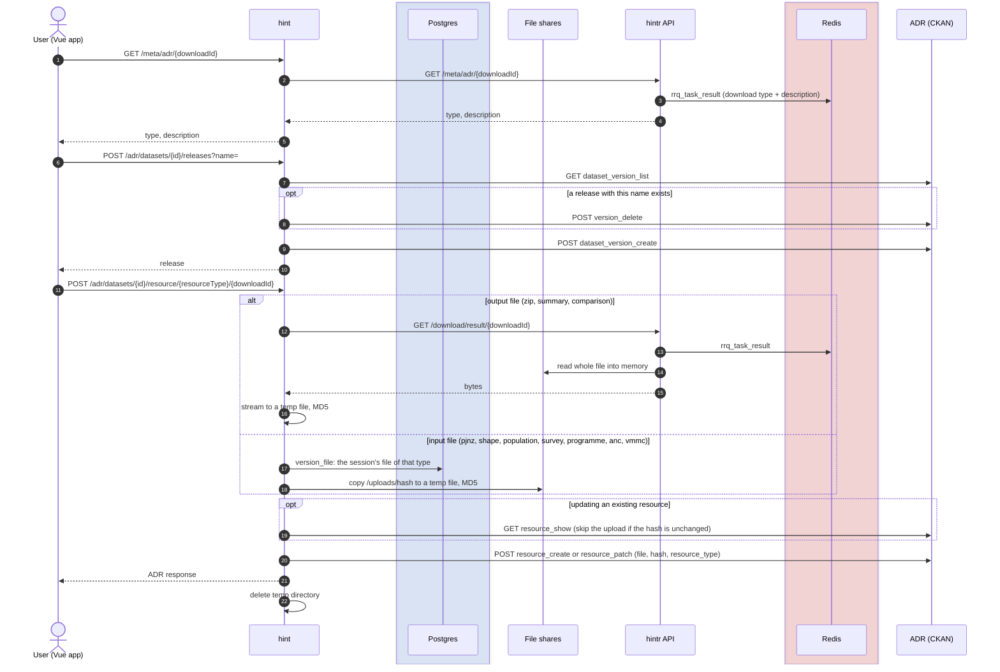
```mermaid
sequenceDiagram
    autonumber
    actor U as User (Vue app)
    participant H as hint
    box rgba(70,130,230,0.15)
    participant PG as Postgres
    end
    participant FS as File shares
    participant R as hintr API
    box rgba(230,70,70,0.18)
    participant RD as Redis
    end
    participant ADR as ADR (CKAN)

    U->>H: GET /meta/adr/{downloadId}
    H->>R: GET /meta/adr/{downloadId}
    R->>RD: rrq_task_result (download type + description)
    R-->>H: type, description
    H-->>U: type, description

    U->>H: POST /adr/datasets/{id}/releases?name=
    H->>ADR: GET dataset_version_list
    opt a release with this name exists
        H->>ADR: POST version_delete
    end
    H->>ADR: POST dataset_version_create
    H-->>U: release

    U->>H: POST /adr/datasets/{id}/resource/{resourceType}/{downloadId}
    alt output file (zip, summary, comparison)
        H->>R: GET /download/result/{downloadId}
        R->>RD: rrq_task_result
        R->>FS: read whole file into memory
        R-->>H: bytes
        H->>H: stream to a temp file, MD5
    else input file (pjnz, shape, population, survey, programme, anc, vmmc)
        H->>PG: version_file: the session's file of that type
        H->>FS: copy /uploads/hash to a temp file, MD5
    end
    opt updating an existing resource
        H->>ADR: GET resource_show (skip the upload if the hash is unchanged)
    end
    H->>ADR: POST resource_create or resource_patch (file, hash, resource_type)
    H-->>U: ADR response
    H->>H: delete temp directory
```

## 18. Debug bundle

For naomi developers, not the UI. `hintr::download_debug()` calls this with a GitHub token. The same GitHub check also protects `/hintr/*` at the proxy ([diagram 20](#20-version-menu-monitoring-and-proxy-routes)).

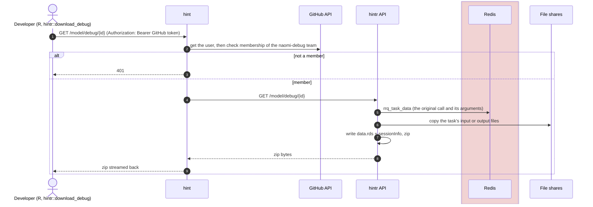
```mermaid
sequenceDiagram
    autonumber
    actor D as Developer (R, hintr::download_debug)
    participant H as hint
    participant GH as GitHub API
    participant R as hintr API
    box rgba(230,70,70,0.18)
    participant RD as Redis
    end
    participant FS as File shares

    D->>H: GET /model/debug/{id} (Authorization: Bearer GitHub token)
    H->>GH: get the user, then check membership of the naomi-debug team
    alt not a member
        H-->>D: 401
    else member
        H->>R: GET /model/debug/{id}
        R->>RD: rrq_task_data (the original call and its arguments)
        R->>FS: copy the task's input or output files
        R->>R: write data.rds + sessionInfo, zip
        R-->>H: zip bytes
        H-->>D: zip streamed back
    end
```

## 19. Error report

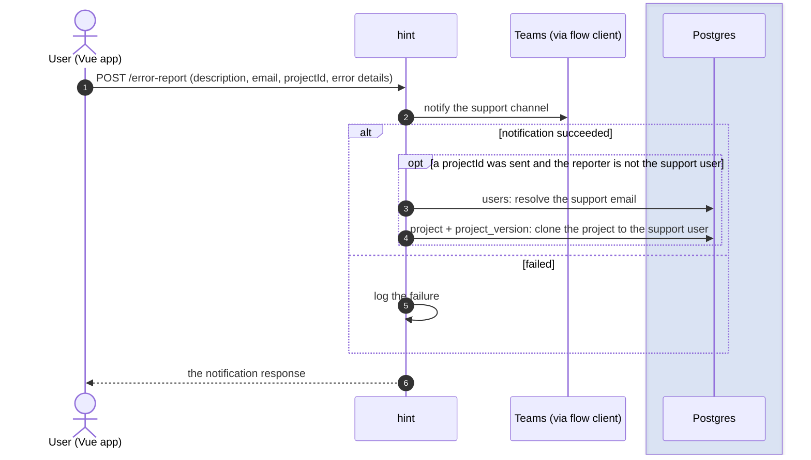
```mermaid
sequenceDiagram
    autonumber
    actor U as User (Vue app)
    participant H as hint
    participant T as Teams (via flow client)
    box rgba(70,130,230,0.15)
    participant PG as Postgres
    end

    U->>H: POST /error-report (description, email, projectId, error details)
    H->>T: notify the support channel
    alt notification succeeded
        opt a projectId was sent and the reporter is not the support user
            H->>PG: users: resolve the support email
            H->>PG: project + project_version: clone the project to the support user
        end
    else failed
        H->>H: log the failure
    end
    H-->>U: the notification response
```

## 20. Version menu, monitoring and proxy routes

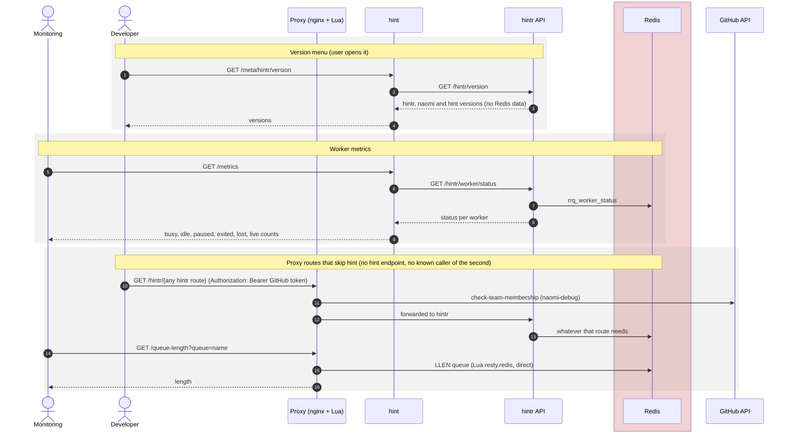
```mermaid
sequenceDiagram
    autonumber
    actor M as Monitoring
    actor D as Developer
    participant P as Proxy (nginx + Lua)
    participant H as hint
    participant R as hintr API
    box rgba(230,70,70,0.18)
    participant RD as Redis
    end
    participant GH as GitHub API

    rect rgba(150,150,150,0.12)
    Note over D,R: Version menu (user opens it)
    D->>H: GET /meta/hintr/version
    H->>R: GET /hintr/version
    R-->>H: hintr, naomi and hint versions (no Redis data)
    H-->>D: versions
    end

    rect rgba(150,150,150,0.12)
    Note over M,RD: Worker metrics
    M->>H: GET /metrics
    H->>R: GET /hintr/worker/status
    R->>RD: rrq_worker_status
    R-->>H: status per worker
    H-->>M: busy, idle, paused, exited, lost, live counts
    end

    rect rgba(150,150,150,0.12)
    Note over D,RD: Proxy routes that skip hint (no hint endpoint, no known caller of the second)
    D->>P: GET /hintr/{any hintr route} (Authorization: Bearer GitHub token)
    P->>GH: check-team-membership (naomi-debug)
    P->>R: forwarded to hintr
    R->>RD: whatever that route needs
    M->>P: GET /queue-length?queue=name
    P->>RD: LLEN queue (Lua resty.redis, direct)
    P-->>M: length
    end
```

## Endpoint index

Every endpoint in hint's Kotlin API, and the `pac4j` ones that hint serves without a controller.

- **Redis ●**: the hintr route reads or writes Redis data (queue, status, results). **○**: it only runs the preroute health check. Blank: hint does not call hintr.
- **Postgres ✔**: the endpoint reads or writes hint's database.

| Method | hint endpoint | Diagram | Postgres | hintr route called | Redis | Notes |
| --- | --- | --- | --- | --- | --- | --- |
| GET | `/  (also /projects, /accessibility, /privacy)` | [2](#2-opening-the-app-logging-in-and-out) | ✔ |  |  | serves index.ftl |
| GET | `/login` | [2](#2-opening-the-app-logging-in-and-out) |  |  |  | serves login.ftl |
| GET | `/oauth2` | [2](#2-opening-the-app-logging-in-and-out) |  |  |  | 303 to Auth0 |
| GET | `/register` | [2](#2-opening-the-app-logging-in-and-out) |  |  |  | 303 to Auth0 sign-up |
| GET | `/sso` | [9](#9-import-inputs-from-adr) |  |  |  | read when the ADR panel opens |
| POST | `/callback/formClient  (pac4j)` | [2](#2-opening-the-app-logging-in-and-out) | ✔ |  |  | password login |
| GET | `/callback/oauth2Client  (pac4j)` | [2](#2-opening-the-app-logging-in-and-out) | ✔ |  |  | Auth0 token exchange |
| GET | `/logout  (pac4j)` | [2](#2-opening-the-app-logging-in-and-out) |  |  |  | Auth0 central logout |
| GET | `/password/forgot-password` | [3](#3-forgotten-password) |  |  |  |  |
| POST | `/password/request-reset-link` | [3](#3-forgotten-password) | ✔ |  |  | SMTP email |
| GET | `/password/reset-password` | [3](#3-forgotten-password) |  |  |  |  |
| POST | `/password/reset-password` | [3](#3-forgotten-password) | ✔ |  |  |  |
| GET | `/user/{email}/exists` | [4](#4-projects) | ✔ |  |  |  |
| GET | `/metrics` | [20](#20-version-menu-monitoring-and-proxy-routes) |  | `GET /hintr/worker/status` | ● | monitoring |
| GET | `/projects/` | [4](#4-projects) | ✔ |  |  |  |
| GET | `/project/current` | [4](#4-projects) | ✔ |  |  |  |
| POST | `/project/` | [4](#4-projects) | ✔ |  |  |  |
| POST | `/project/{projectId}/rename` | [4](#4-projects) | ✔ |  |  |  |
| POST | `/project/{projectId}/note` | [4](#4-projects) | ✔ |  |  |  |
| POST | `/project/{projectId}/clone` | [4](#4-projects) | ✔ |  |  |  |
| DELETE | `/project/{projectId}` | [4](#4-projects) | ✔ |  |  | soft delete |
| POST | `/project/{projectId}/version/` | [5](#5-versions-autosave-and-opening-a-saved-version) | ✔ |  |  |  |
| POST | `/project/{projectId}/version/{versionId}/state` | [5](#5-versions-autosave-and-opening-a-saved-version) | ✔ |  |  | autosave, holds task ids |
| POST | `/project/{projectId}/version/{versionId}/promote` | [5](#5-versions-autosave-and-opening-a-saved-version) | ✔ |  |  |  |
| POST | `/project/{projectId}/version/{versionId}/note` | [5](#5-versions-autosave-and-opening-a-saved-version) | ✔ |  |  |  |
| GET | `/project/{projectId}/version/{versionId}` | [5](#5-versions-autosave-and-opening-a-saved-version) | ✔ |  |  |  |
| DELETE | `/project/{projectId}/version/{versionId}` | [5](#5-versions-autosave-and-opening-a-saved-version) | ✔ |  |  | soft delete |
| POST | `/session/files/` | [5](#5-versions-autosave-and-opening-a-saved-version) | ✔ |  |  | also used by rehydrate (diagram 10) |
| POST | `/baseline/pjnz/` | [6](#6-upload-baseline-files-pjnz-shape-population) | ✔ | `POST /validate/baseline-individual` | ○ | writes /uploads |
| GET | `/baseline/pjnz/` | [6](#6-upload-baseline-files-pjnz-shape-population) | ✔ | `POST /validate/baseline-individual` | ○ | re-validates every call |
| DELETE | `/baseline/pjnz/` | [6](#6-upload-baseline-files-pjnz-shape-population) | ✔ |  |  | file stays on share |
| POST | `/baseline/shape/` | [6](#6-upload-baseline-files-pjnz-shape-population) | ✔ | `POST /validate/baseline-individual` | ○ | writes /uploads |
| GET | `/baseline/shape/` | [6](#6-upload-baseline-files-pjnz-shape-population) | ✔ | `POST /validate/baseline-individual` | ○ | re-validates every call |
| DELETE | `/baseline/shape/` | [6](#6-upload-baseline-files-pjnz-shape-population) | ✔ |  |  | file stays on share |
| POST | `/baseline/population/` | [6](#6-upload-baseline-files-pjnz-shape-population) | ✔ | `POST /validate/baseline-individual` | ○ | writes /uploads |
| GET | `/baseline/population/` | [6](#6-upload-baseline-files-pjnz-shape-population) | ✔ | `POST /validate/baseline-individual` | ○ | re-validates every call |
| DELETE | `/baseline/population/` | [6](#6-upload-baseline-files-pjnz-shape-population) | ✔ |  |  | file stays on share |
| GET | `/baseline/validate/` | [6](#6-upload-baseline-files-pjnz-shape-population) | ✔ | `POST /validate/baseline-combined` | ○ |  |
| POST | `/disease/survey/` | [7](#7-upload-survey-programme-anc-and-vmmc) | ✔ | `POST /validate/survey-and-programme` | ○ | writes /uploads |
| GET | `/disease/survey/` | [7](#7-upload-survey-programme-anc-and-vmmc) | ✔ | `POST /validate/survey-and-programme` | ○ | re-validates every call |
| DELETE | `/disease/survey/` | [7](#7-upload-survey-programme-anc-and-vmmc) | ✔ |  |  | file stays on share |
| POST | `/disease/programme/` | [7](#7-upload-survey-programme-anc-and-vmmc) | ✔ | `POST /validate/survey-and-programme` | ○ | writes /uploads |
| GET | `/disease/programme/` | [7](#7-upload-survey-programme-anc-and-vmmc) | ✔ | `POST /validate/survey-and-programme` | ○ | re-validates every call |
| DELETE | `/disease/programme/` | [7](#7-upload-survey-programme-anc-and-vmmc) | ✔ |  |  | file stays on share |
| POST | `/disease/anc/` | [7](#7-upload-survey-programme-anc-and-vmmc) | ✔ | `POST /validate/survey-and-programme` | ○ | writes /uploads |
| GET | `/disease/anc/` | [7](#7-upload-survey-programme-anc-and-vmmc) | ✔ | `POST /validate/survey-and-programme` | ○ | re-validates every call |
| DELETE | `/disease/anc/` | [7](#7-upload-survey-programme-anc-and-vmmc) | ✔ |  |  | file stays on share |
| POST | `/disease/vmmc/` | [7](#7-upload-survey-programme-anc-and-vmmc) | ✔ | `POST /validate/survey-and-programme` | ○ | writes /uploads |
| GET | `/disease/vmmc/` | [7](#7-upload-survey-programme-anc-and-vmmc) | ✔ | `POST /validate/survey-and-programme` | ○ | re-validates every call |
| DELETE | `/disease/vmmc/` | [7](#7-upload-survey-programme-anc-and-vmmc) | ✔ |  |  | file stays on share |
| GET | `/chart-data/input-time-series/{type}` | [11](#11-review-inputs) | ✔ | `POST /chart-data/input-time-series/{type}` | ○ |  |
| GET | `/chart-data/input-comparison` | [11](#11-review-inputs) | ✔ | `POST /chart-data/input-comparison` | ○ |  |
| GET | `/chart-data/input-population` | [11](#11-review-inputs) | ✔ | `POST /chart-data/input-population` | ○ |  |
| POST | `/meta/review-inputs/{iso3}` | [11](#11-review-inputs) | ✔ | `POST /review-input/metadata` | ○ |  |
| GET | `/meta/hintr/version` | [20](#20-version-menu-monitoring-and-proxy-routes) |  | `GET /hintr/version` | ○ | version menu |
| GET | `/model/options/` | [12](#12-model-options) | ✔ | `POST /model/options` | ○ |  |
| POST | `/model/validate/options/` | [12](#12-model-options) | ✔ | `POST /validate/options` | ○ |  |
| POST | `/model/run/` | [13](#13-run-a-model-fit) | ✔ | `POST /model/submit` | ● | queues a fit |
| GET | `/model/status/{id}` | [13](#13-run-a-model-fit) |  | `GET /model/status/{id}` | ● | polled every 2 s |
| GET | `/model/result/{id}` | [13](#13-run-a-model-fit) |  | `GET /model/result/{id}` | ● | also on every reload (diagram 8) |
| POST | `/model/cancel/{id}` | [13](#13-run-a-model-fit) |  | `POST /model/cancel/{id}` | ● |  |
| GET | `/model/comparison/plot/{id}` | [15](#15-view-calibrated-results) |  | `GET /comparison/plot/{id}` | ● | R reads qs2, also on reload |
| GET | `/model/debug/{id}` | [18](#18-debug-bundle) |  | `GET /model/debug/{id}` | ● | GitHub token, not the UI |
| GET | `/calibrate/options/{iso3}` | [14](#14-calibrate) |  | `POST /calibrate/options/{iso3}` | ○ |  |
| POST | `/calibrate/submit/{id}` | [14](#14-calibrate) |  | `POST /calibrate/submit/{id}` | ● | queues a calibration |
| GET | `/calibrate/status/{id}` | [14](#14-calibrate) |  | `GET /calibrate/status/{id}` | ● | polled every 2 s |
| GET | `/calibrate/result/metadata/{id}` | [15](#15-view-calibrated-results) |  | `GET /calibrate/result/metadata/{id}` | ● | R reads duckdb, also on reload |
| GET | `/calibrate/plot/{id}` | [15](#15-view-calibrated-results) |  | `GET /calibrate/plot/{id}` | ● | R reads qs2, also on reload |
| POST | `/calibrate/result/filteredData/{id}` | [15](#15-view-calibrated-results) |  | `GET /calibrate/result/path/{id}` | ● | hint reads duckdb itself |
| GET | `/calibrate/result/data/{id}/{indicator}` | [15](#15-view-calibrated-results) |  | `GET /calibrate/result/path/{id}` | ● | no frontend caller found |
| POST | `/download/submit/{type}/{id}` | [16](#16-download-outputs) | ✔ | `POST /download/submit/{type}/{id}` | ● | queues a download |
| GET | `/download/status/{id}` | [16](#16-download-outputs) |  | `GET /download/status/{id}` | ● | polled every 2 s |
| GET | `/download/result/{id}` | [16](#16-download-outputs) |  | `GET /download/result/{id}` | ● | R reads whole file |
| POST | `/rehydrate/zip` | [10](#10-load-a-project-from-an-output-zip-or-adr-rehydrate) |  | `GET /task/{id}/exists` | ● | called twice (fit and calibrate) |
| POST | `/rehydrate/adr` | [10](#10-load-a-project-from-an-output-zip-or-adr-rehydrate) |  | `GET /task/{id}/exists` | ● | called twice, ADR download first |
| GET | `/adr/key` | [9](#9-import-inputs-from-adr) | ✔ |  |  |  |
| POST | `/adr/key` | [9](#9-import-inputs-from-adr) | ✔ |  |  |  |
| DELETE | `/adr/key` | [9](#9-import-inputs-from-adr) | ✔ |  |  |  |
| GET | `/adr/schemas` | [9](#9-import-inputs-from-adr) |  |  |  | config only, read on every load |
| GET | `/adr/datasets` | [9](#9-import-inputs-from-adr) | ✔ |  |  | ADR; key or token |
| GET | `/adr/datasets/{id}` | [9](#9-import-inputs-from-adr) | ✔ |  |  | ADR |
| GET | `/adr/datasets/{id}/releases` | [9](#9-import-inputs-from-adr) | ✔ |  |  | ADR |
| GET | `/adr/orgs` | [9](#9-import-inputs-from-adr) | ✔ |  |  | ADR |
| POST | `/adr/pjnz` | [9](#9-import-inputs-from-adr) | ✔ | `POST /validate/baseline-individual` | ○ | ADR download, writes /uploads |
| POST | `/adr/shape` | [9](#9-import-inputs-from-adr) | ✔ | `POST /validate/baseline-individual` | ○ | ADR download, writes /uploads |
| POST | `/adr/population` | [9](#9-import-inputs-from-adr) | ✔ | `POST /validate/baseline-individual` | ○ | ADR download, writes /uploads |
| POST | `/adr/survey` | [9](#9-import-inputs-from-adr) | ✔ | `POST /validate/survey-and-programme` | ○ | ADR download, writes /uploads |
| POST | `/adr/programme` | [9](#9-import-inputs-from-adr) | ✔ | `POST /validate/survey-and-programme` | ○ | ADR download, writes /uploads |
| POST | `/adr/anc` | [9](#9-import-inputs-from-adr) | ✔ | `POST /validate/survey-and-programme` | ○ | ADR download, writes /uploads |
| POST | `/adr/vmmc` | [9](#9-import-inputs-from-adr) | ✔ | `POST /validate/survey-and-programme` | ○ | ADR download, writes /uploads |
| POST | `/adr/output` | [9](#9-import-inputs-from-adr) | ✔ |  |  | no frontend caller found |
| GET | `/meta/adr/{id}` | [17](#17-push-outputs-and-inputs-to-adr) |  | `GET /meta/adr/{id}` | ● |  |
| POST | `/adr/datasets/{id}/releases` | [17](#17-push-outputs-and-inputs-to-adr) | ✔ |  |  | ADR |
| POST | `/adr/datasets/{id}/resource/{resourceType}/{downloadId}` | [17](#17-push-outputs-and-inputs-to-adr) | ✔ | `GET /download/result/{id}` | ● | R call only for output files, ADR upload |
| POST | `/error-report` | [19](#19-error-report) | ✔ |  |  | Teams, clones project to support user |

## hintr routes hint never calls

Not reachable from the Kotlin API, but part of hintr's surface and relevant to a migration:

| hintr route | Used by |
| --- | --- |
| `POST /internal/upload/input/{filename}`, `POST /internal/upload/result/{filename}`, `POST /internal/prerun` | `hintr::hintr_submit_prerun()`. `/internal/prerun` writes made-up results straight into rrq's Redis keys (`rrq:::run_task_cleanup_success`) |
| `POST /hintr/stop` | Stops workers and quits hintr (ops) |
| `GET /calibrate/result/{id}`, `GET /calibrate/result/data/{id}` | Computes result data in R. hint reads the duckdb itself instead |
| `GET /download/result/path/{id}`, `HEAD /download/result/{id}` | Not called by hint |
